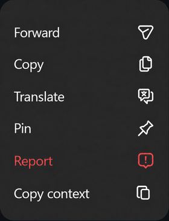
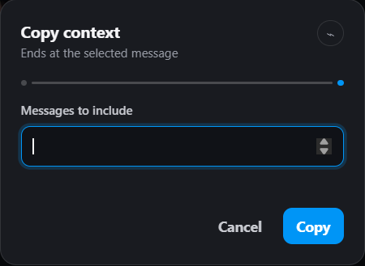

<div align="center">
  
  <h1>DM2Text</h1>
  <p>Copy clean, structured context from Instagram Direct—without sending your conversations anywhere.</p>
  <p>
    <a href="https://github.com/postigodev/dm2text/releases/latest"></a>
    <a href="https://github.com/postigodev/dm2text/actions/workflows/ci.yml"></a>
    <a href="LICENSE"></a>
    
  </p>
</div>

DM2Text adds a native-looking **Copy context** action to each message menu. Select an end message, choose how many messages you need, and the extension collects the preceding context into a chronological transcript on your clipboard.

## Features

- Uses the selected message as an immutable end anchor.
- Collects older messages automatically through Instagram's virtualized chat history.
- Preserves senders, visible timestamps, text, replies, media labels, shared posts, emoji, and Meta AI responses when available.
- Keeps messages ordered from oldest to newest and excludes anything after the anchor.
- Supports cancellation, partial-copy confirmation, and best-effort viewport restoration.
- Matches Instagram's light or dark appearance with a small, native-looking interface.
- Processes conversation content locally with no persistence or extension-originated network traffic.

## See it in action

One native-looking action opens one focused copy session.

<table>
  <tr>
    <td align="center"></td>
    <td align="center"></td>
  </tr>
  <tr>
    <td align="center"><sub>Choose Copy context on the anchor message.</sub></td>
    <td align="center"><sub>Enter the number of messages and start the copy session.</sub></td>
  </tr>
</table>

## Install

Install DM2Text from the [Chrome Web Store](https://chromewebstore.google.com/detail/dm2text/gpedpddbcooaomkehnmpcjjghnbknpbd).

For local development or manual installation, download the package from the [latest GitHub release](https://github.com/postigodev/dm2text/releases/latest), extract it to a permanent folder, enable **Developer mode** at `chrome://extensions`, and choose **Load unpacked**.

## Use

1. Open a conversation in Instagram Direct.
2. Hover the final message you want in the transcript and open its three-dot menu.
3. Choose **Copy context**.
4. Enter the number of messages to collect.
5. Paste the resulting transcript wherever you need it.

If Instagram cannot expose the full requested range, DM2Text asks before copying the available portion.

### Transcript format

```text
[10:41 AM, Tuesday] Person A: Did you see the draft?
You (replying to Person A: Did you see the draft?): Yes, sending notes now.
Person B: [shared post by example.account]
  Caption: A visible post caption
Person A: [image]
```

## Privacy

Conversation data exists only in page memory while a copy session is active. DM2Text does not persist message content and initiates no fetch, XHR, WebSocket, beacon, or other extension-originated network request.

The only intentional output is the transcript you request on the operating-system clipboard. Clipboard contents remain available to the operating system and other applications until replaced.

## Local development

Install [Node.js](https://nodejs.org/) and [pnpm](https://pnpm.io/), then run:

```powershell
pnpm install
pnpm dev
```

While WXT is running, open the browser's extension manager, enable **Developer mode**, choose **Load unpacked**, and select `.output/chrome-mv3-dev`.

Useful commands:

```powershell
pnpm test       # Run the test suite once
pnpm typecheck  # Check strict TypeScript types
pnpm build      # Create a production build
pnpm zip        # Package the production extension
```

The implementation is split by responsibility:

- `src/instagram/` isolates Instagram DOM discovery, parsing, and scrolling.
- `src/collection/` owns the transient copy session.
- `src/transcript/` selects and formats normalized messages.
- `src/ui/` creates the session dialog and toasts only when needed.

## Community

Contributions are welcome. Read the [contribution guide](CONTRIBUTING.md), [code of conduct](CODE_OF_CONDUCT.md), and [security policy](SECURITY.md) before opening an issue or pull request.

DM2Text is an independent project and is not affiliated with, endorsed by, or sponsored by Instagram or Meta.

## License

Copyright © 2026 Piero A. Postigo Rocchetti. DM2Text is licensed under [GPL-3.0-only](LICENSE).

## Limitations

Instagram virtualizes conversations and can change its private DOM without notice. DOM changes may require updates to DM2Text's centralized selectors and anonymized fixtures. Data that Instagram does not expose in the mounted page cannot be included, and restoring the selected message to the viewport is best-effort and bounded to three seconds.

The project budgets are less than 60 KB of total minified JavaScript and less than 200 KB for the packaged extension.
